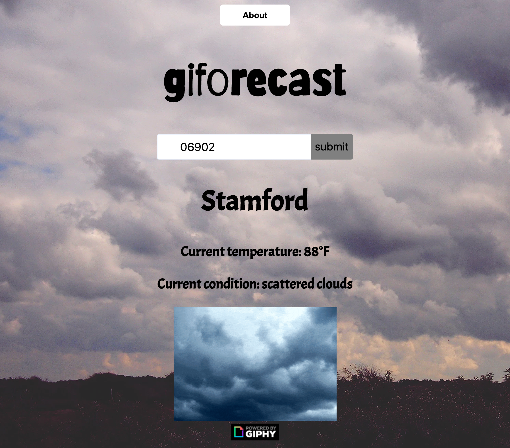

# giforecast

https://zachgordon25.github.io/weather-app

giforecast is a weather app that uses the weather report to get a fitting gif. I used two APIs two make this possible. I grabbed the weather data from openweathermap.org and the gifs from giphy.com. I started out this project with just making it a weather app but then later decided that I wanted to give it a little more flavor. My biggest struggle while doing this project was doing the formatting and styling. If I had more time to do this project I would work more on animations and more css.

